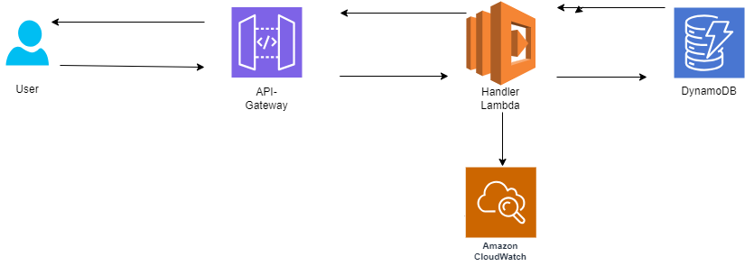

## BMO Pre-Interview Event-Driven CDK TypeScript Project

### Overview:

This project showcases a simplified, event-driven WooCommerce application built with Cloud Development Kit (CDK) and TypeScript. It demonstrates user request handling, database interactions, and logging mechanisms:

Users send requests via an API Gateway endpoint.
A Lambda function processes the request, retrieving data from a DynamoDB NoSQL database.
Responses are sent back to the user.
Logs are streamed to CloudWatch for monitoring and analysis.

## Key Technologies:

### CDK:

- Enables infrastructure automation and provisioning via Infrastructure as Code (IaC).
- TypeScript: Enhances code maintainability and type safety.
- API Gateway: Serves as the entry point for user requests.
- Lambda: Serverless functions handle business logic and database interactions.
- DynamoDB: Flexible NoSQL database for efficient data storage and retrieval.
- CloudWatch: Centralized logging service for comprehensive insights into invocations, errors, and metrics.

## Benefits

### Scalability:

- Serverless architecture automatically scales with traffic demands.
- Cost Optimization: Pay only for used resources, minimizing idle costs.
- Availability: Highly available services ensure minimal downtime.
- Fault Tolerance: Automatic retries and redundancy built into the infrastructure.

### Useful Commands:

- cdk bootstrap: Initializes CDK environment and tools.
- cdk deploy: Deploys the project to your default AWS account/region.
- cdk diff: Compares deployed stack with current state for change detection.
- cdk synth: Generates and displays the CloudFormation template without deployment.
- cdk destroy: Removes the deployed stack from your account.

## Getting Started:

1. Set up your AWS environment with an IAM user and configure CDK.
2. Clone this repository and install dependencies: npm install.
3. Run cdk bootstrap to set up the CDK environment.
4. Customize the app.ts file and Lambda functions as needed.
5. Deploy the project with cdk deploy.

### Architecture:

User: Initiates requests through an API Gateway endpoint.
API Gateway: Routes requests to the appropriate Lambda function based on path and method.
Lambda Function: Processes the request, fetching data from DynamoDB using the AWS SDK.
DynamoDB: Stores and retrieves application data in a NoSQL format.
CloudWatch: Collects and stores logs from API Gateway and Lambda for easy access and analysis.
Response: Delivers the processed response back to the user via the API Gateway.

### Additional Notes:

Ensure you have the necessary AWS permissions to create and manage resources.
AWS Cloudwatch implemented also helps Integrate error handling and logging for comprehensive troubleshooting.

## Conclusion:

This project serves as a valuable learning experience and demonstrates the power of event-driven architectures built with CDK and TypeScript.
